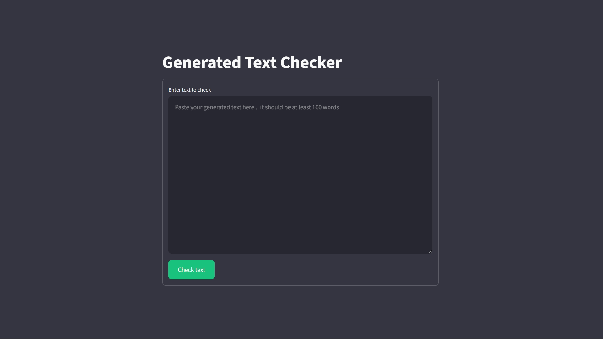
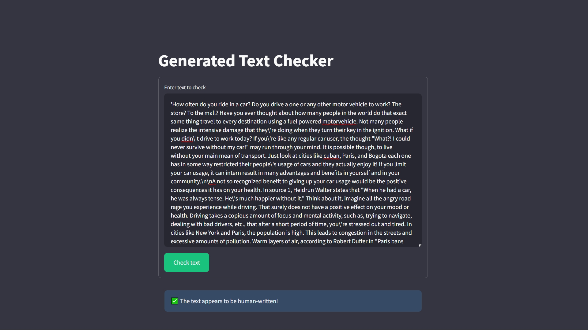

# AI Text Detector

A streamlit-based application that helps identify whether text was generated by AI or written by humans. Built using Streamlit and machine learning.

## Features

- Real-time text classification
- Minimum word count validation (100 words)
- User-friendly web interface
- Text preprocessing pipeline
- Clear visual feedback for results

## Dataset
Use this [dataset](https://www.kaggle.com/datasets/shanegerami/ai-vs-human-text) to train the model, download and put it in the data folder


## Download Pre-Trained Model
Use this [google-driver](https://drive.google.com/file/d/1xfbLmU2LjjFStv7KgWanjG89h4kraJzk/view?usp=sharing) link to download the model, you can train it again and put it in the models folder.


## Demo

The application provides a simple yet powerful interface for checking text. Here's how it works:

### 1. Input Text



The main interface features a large text area where you can paste or type the text you want to check. The application requires a minimum of 100 words for accurate classification.

### 2. Results



After submitting the text, the application will process it and display whether it appears to be human-written or AI-generated. The results are shown with clear visual indicators and informative messages.

## Setup

1. Create and activate a virtual environment:
   ```bash
   # Create virtual environment
   python -m venv venv
   
   # Activate virtual environment
   # Windows
   .\venv\Scripts\activate
   # Linux/MacOS
   source venv/bin/activate
   ```

2. Install the required dependencies:
```bash
pip install -r requirements.txt
```

3. Run the application:
```bash
python run.py
```

4. Open your web browser and navigate to `http://localhost:8501`

## Technical Details

The application uses a machine learning model trained to distinguish between AI-generated and human-written text. The preprocessing pipeline includes:
- Lowercasing
- Punctuation removal
- Stopword removal
- URL and email removal
- Number removal
- Non-printable character removal

## Model Training

The machine learning model used in this application was trained using the Jupyter notebook [generated-text-classification.ipynb](generated-text-classification.ipynb).

The trained model is saved as `models/best_model.joblib` and is loaded automatically when the application starts.

The model achieves 100% accuracy and an F1-score of 100, but its performance is constrained to data similar to what is presented in the training dataset. Therefore, it struggles to generalize across diverse data types. Nonetheless, it performs exceptionally well in distinguishing between AI-generated and human-generated text.

## Requirements

- Python 3.8+
- pip
- All dependencies listed in [requirements.txt](requirements.txt)

## Contributing

Contributions are welcome! Please feel free to submit a Pull Request.

## License

This project is licensed under the MIT License - see the LICENSE file for details.
